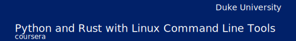

[](https://www.coursera.org/learn/python-rust-linux "Python and Rust with Linux Command Line Tools")

# Accelerated Python

An example of speeding up Python programs using Rust.

👉 [External Lab: Writing Calculator CLI with Python Fire and Rust](https://www.coursera.org/learn/python-rust-linux/home/module/3)

## Setup

```sh
$ python3 -m venv .venv
$ source .venv/bin/activate
$ make install
$ make build
```

## Use CLI

```sh
# Used only native Python code.
$ ./calc.py native_add 2 3
5
# Used external binary library.
$ ./calc.py accelerated_add 2 3
5
```
